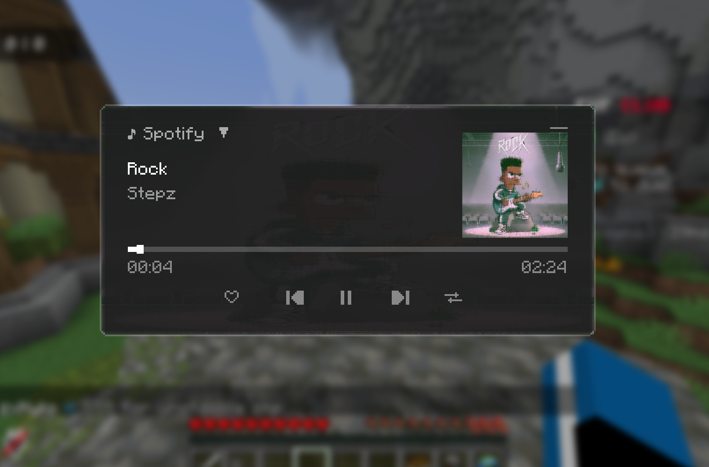
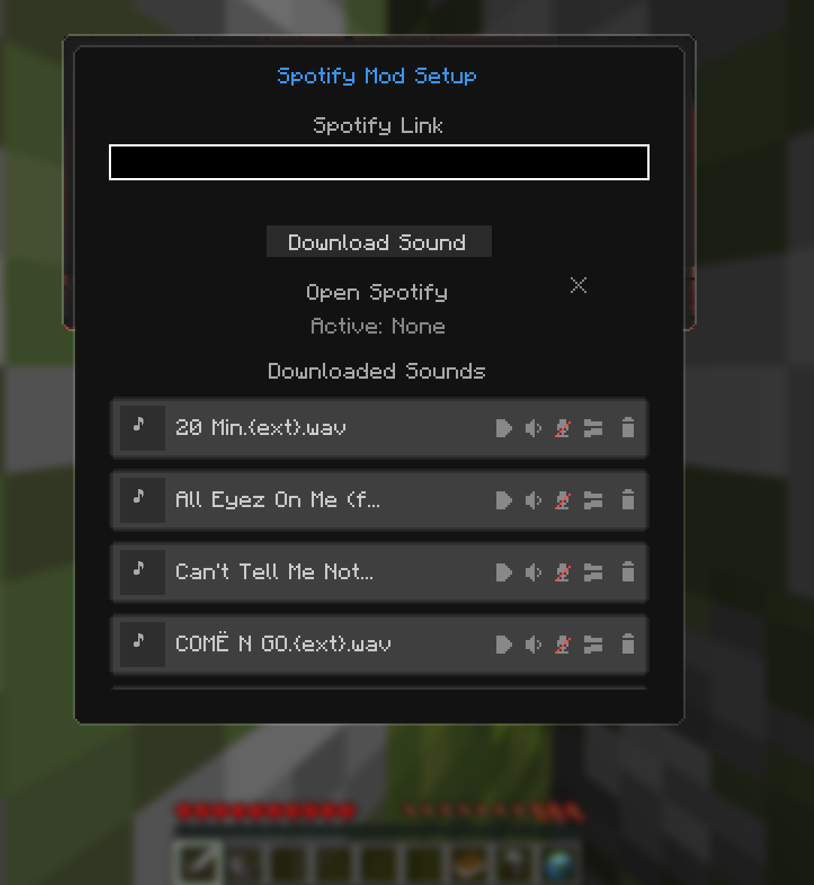

# AudioStrike for Minecraft

  

  

> ⚠️ **Note:** AudioStrike is currently in **Alpha**! Features are being actively developed and more updates are coming soon. 
> 
> 🧪 **We need testers!** It would be incredibly helpful if you could download the mod, test out the features, and report any bugs or ideas in our Discord!
> 
> 🎮 **Compatible with version 26.1.2**

## ✨ Features

### 🎵 Core Features
- **In-Game Media Controller:** Press `R` to open a sleek, glassmorphic UI overlay. Play, pause, skip, and adjust volume for your system media (Spotify, YouTube, Apple Music, etc.) directly inside Minecraft without Alt-Tabbing.
- **Live Track Display:** See exactly what song is currently playing on your PC right on your Minecraft screen.
- **Voice Chat Integration:** Automatically broadcasts your currently playing music over proximity chat so everyone around you can hear what you're listening to!

### ⚔️ Combat Features
- **Custom Kill Sounds:** Assign custom audio files that will automatically trigger the moment you slay another player.
- **Kill Sound Broadcasting:** Your kill sounds are blasted over proximity voice chat for the ultimate flex.
- **10-Second Auto-Cutoff:** Kill sounds have a strict 10-second timer to ensure long songs don't spam the server during fast-paced PvP.

### 🛠️ Built-in Tools
- **Audio Gallery Menu:** An in-game file browser to listen to and select your active kill sounds.
- **In-Game Audio Cropper:** Found the perfect meme audio but it's too long? Trim and crop MP3/WAV files directly inside Minecraft without needing external editing software.
- **Spotify Downloader:** Built-in integration with `spotdl`. Paste a Spotify link directly into the mod to download it on the fly for your kill sounds.
- **Windows Media Companion:** Comes with a custom background helper (`MediaHelper.exe`) that hooks flawlessly into Windows to control your media instantly.

## 📸 Screenshots

  
  

## 🚀 Installation

1. Download the latest `.jar` from the [Releases](https://github.com/GTsim1/AudioStrike/releases) tab.
2. Drop it into your Minecraft `mods` folder.
3. Ensure you have the [Fabric API](https://modrinth.com/mod/fabric-api) installed.
4. *(Optional)* Install the [Simple Voice Chat](https://modrinth.com/plugin/simple-voice-chat) mod for the microphone transmission features.

## 🛠️ Usage

- Press **`R`** (default) in-game to open the Media Control Screen.
- Use the hamburger menu in the top right to access the **Setup Menu**.
- Paste a Spotify link to download it, and manage your downloaded sounds via the gallery.

> 🛡️ **Antivirus Notice:** Because this mod uses an invisible C# background process (`MediaHelper.exe`) to read your Windows Media APIs, some aggressive antiviruses (like Windows Defender) might flag it as a "false positive". This is completely normal for new, unsigned executables. The code is 100% open-source and viewable in this repository!

## 📄 License
This project is licensed under the MIT License.
